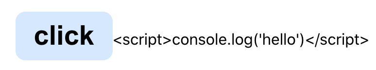

## 先来发现这个属性

先随便创建一个React的项目或者随便找手头一个现有的项目(我这边选择创建一个空的React项目)

```
$ npx create-react-app test
```

然后我在这个project的首页里随便打印一个React Element出来，比如选择打印一个div吧。

```jsx
console.log(<div>test</div>)
```

然后打开控制台就可以看到这个div元素已经转变成一个js对象然后打印出来的结果。


可以看到第一个属性就是现在要讨论的重点---`$$typeof: Symbol(react.element)`


## 验证一些不安全的可能性

都知道写好的React会根据JSX的语法规则将现有的界面代码转换成一个又`JS Object`组成的对象树，也就是`Virtual Dom Tree`。

就像这个样子

```html
<div id="hello">test</div>
```

其实是调用了`React.createElement()`的方法来创建一个对应的`JS Object`来描述这个element。

```js
React.creactElement(
  /* type */ 'div',
  /* props */ { id: 'hello' },
  /* children */ 'test'
)
```

然后就会生成一个像这样的对象(上方给的第一张图的内容)

```js
{
  props: { id: 'hello' },
  type: 'div',
  key: null,
  ref: null,
  $$typeof: Symbol.for('react.element'),
  ...
}
```

其实这个原理，或者说React的实际实现方法是很多人都知道的。而我们可以通过`一些操作`来生成这种React Element对象，或者向已有的对象中增加一些东西。

比如

我现在有一个特别简单的组件

```jsx
const Test = (props) => {
  const [message, setMessage] = useState({
    text: 'hello'
  })

  const handleClick = () => {
    const element = document.getElementById('test')
    element.innerHTML = '<p>' + message.text + '</p>'
  }

  return (
    <div>
      <button
        className="btn"
        onClick={handleClick}
      >
        click
      </button>
      <span id="test"></span>
    </div>
  )
}

export default Test
```

效果就是当我点击屏幕上的Button，就会执行一个向span中塞入html元素的操作。


就像图里展示的点击之后下方空白的位置就会出现`hello`的文字。

### 但是我要塞一些奇怪的东西呢？

我现在尝试如果塞得是一个``而不是文本，同样起作用吗？


**所以这时候就很容插入一些恶意的代码来做一些不好的事情**

> 值得注意的是这里如果想插入一个`<script></script>`的话，标签内部的代码是不会被执行的。

来写一下看看实际情况

```jsx
const [message, setMessage] = useState({
  text: '<script>console.log(\'hello\')</script>'
})
```

点击界面上的button没有任何反应。

## React有基础的安全措施

在一般日常的开发中，并不会写类似于`innerHtml`这样的代码，而多半是这么写的

```html
<p>{message.text}</p>
```

这样的写法是满足React自带`文本默认转换机制`的。这样标签就会被直接转意为字符串展示在界面。来看看效果。




> 但是这并没有解决刚才那种innerHtml来插入恶意代码的问题。

为了防止这种攻击，就只能通过调用只处理文本的` document.createTextNode() `或者 `textContent`等安全的 API。

**但是实际项目中替换成本很大，效果不理想。**

## $$typeof登场

刚才说到了React是有默认转意的设定，所以按正常写法想要往元素中插入任意html元素只能使用`dangerouslySetInnerHTML={{ __html: message.text }}`

这里引用一段话

> React 元素（elements）是设计好的 plain object

`plain object`的意思就是最普通的`{}`里的key-value形式的对象，或者是`new Object()`创建的对象。


而`非plain object`就是类似于`function | Array`这样的引用类型的对象。

那这又和$$typeof有什么关系呢？

有几种情况：

比如服务端是允许存储JSON格式的数据

现在从服务端获取到了一个JSON格式的数据
```js
{
  type: 'div',
  props: {
    dangerouslySetInnerHTML: {
      __html: 'do something bad'
    },
  },
  // ...
}
```

然后我把拿到的JSON数据当作更新某个react element的属性值

```js
const result = {
  type: 'div',
  props: {
    dangerouslySetInnerHTML: {
      __html: 'do something bad'
    },
  },
  // ...
}

setMessage({ text: result })

// React 0.13 中有风险
<p>
  {message.text}
</p>
```

那么这种情况就很容易受到XSS攻击，因为可能从服务端传回来的数据(因为某种漏洞)已经被携带了恶意代码。

这时候`$$typeof: Symbol.for('react.element')`就派上用场了。

我们知道Symbol本身的作用就是`独一无二`的标识。

⬇️⬇️⬇️⬇️⬇️结论 ⬇️⬇️⬇️⬇️⬇️

服务端没有办法存储Symbol类型的值，也无法添加。所以当原本的数据被替换成恶意的对象时，这个对象是不包含`$$typeof`属性的。

React会检测合法的`$$typeof`属性，不符合条件React就不会处理这个元素。

## $$typeof是如何被添加到对象上的？

这是我在github的React[仓库源码](https://github.com/facebook/react/blob/master/packages/react/src/ReactElement.js)中找到的(参考资料里的链接失效了...)

```js
export function createElement(type, config, children) {
  // ...省略一万行
  return ReactElement(
    type,
    key,
    ref,
    self,
    source,
    ReactCurrentOwner.current,
    props,
  );
}
```

可以看到`React.createElement()`这个方法返回的是`ReactElement()`构造函数执行过后的实例对象。


那再来看一下`ReactElement()`这个构造函数干了些什么。

```js
const ReactElement = function(type, key, ref, self, source, owner, props) {
  const element = {
    // This tag allows us to uniquely identify this as a React Element
    $$typeof: REACT_ELEMENT_TYPE,

    // Built-in properties that belong on the element
    type: type,
    key: key,
    ref: ref,
    props: props,

    // Record the component responsible for creating this element.
    _owner: owner,
  };

  // ...

  return element
}
```

可以看到在这里在实例化的过程中附上了`$$typeof`属性，值为`REACT_ELEMENT_TYPE`。

在[源码另一处]()找到了`REACT_ELEMENT_TYPE`的定义。

```js
export let REACT_ELEMENT_TYPE = 0xeac7;

if (typeof Symbol === 'function' && Symbol.for) {
  const symbolFor = Symbol.for;
  REACT_ELEMENT_TYPE = symbolFor('react.element');
  // ...
}
```

这里Symbol会有一个默认值，是因为有的浏览器不支持Symbol时就会使用这个默认值，`但是这个默认值就只是一个数字。`

> 至于为什么选用`0xeac7`这个数字，Dan给出的答案是，它很像React。

这里让我想起了一个忽略掉的知识点是

在创建具体的Symbol时只能调用`Symbol()`函数而不是用new的方法来创建。

所以这里`typeof Symbol === ’function'`的作用是判断浏览器是否支持Symbol。

### 为什么用Symbol.for？

这里引用Dan的一段原话

> The nice thing about using Symbol.for() specifically is that Symbols are global between environments like iframes and workers. So this fix doesn’t prevent passing trusted elements between different parts of the app even in more exotic conditions. Similarly, even if there are multiple copies of React on the page, they can still “agree” on the valid $$typeof value.

大意就是Symbol.for()是可以在像类似`iframe`或者`worker`这种全局环境中都能独立标识一个值。所以`$$typeof`属性就不会影响到一些可以在全局环境中传递的React Element。或者当界面有多个副本存在时，也能`agree`到正确的`$$typeof`。

但说实话这里我不太懂。。。

## 结论

服务端没有办法存储Symbol类型的值，也无法添加。所以当原本的数据被替换成恶意的对象时，这个对象是不包含`$$typeof`属性的。

React会检测合法的`$$typeof`属性，不符合条件React就不会处理这个元素。


