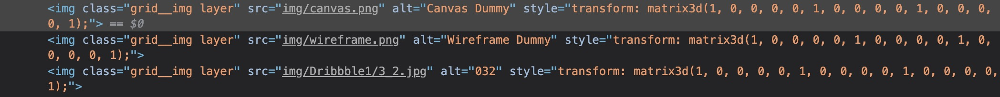
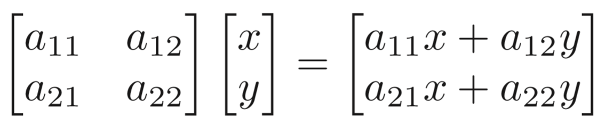

接触前端以来，总是会听到类似于前端相对简单的言论，再精确一些就是CSS很简单。

其实我有的时候对自己评估，css、js、html三大块我比较弱的可能就是css了。我从来没有觉得css很简单啊(掀桌.jpg）。

今天就来看看CSS中涉及到的高端知识点。当然一说到高端，那必须拿出数学来撑门面，所以今天的主题，就是`CSS与矩阵`。

## Why？

其实就是偶然看到了这个图，很好奇，然后按下了`F12`。


发现了这段神奇的代码。



觉得这个效果看起来很棒，到底是怎么实现的呢？今天来尝试尝试。废话不多说， Here we go!

## 老项目创建者了

先随便创建一个React的项目或者随便找手头一个现有的项目(我这边选择创建一个空的React项目)

```
$ npx create-react-app test
```

然后我需要把项目里不需要的代码修修改改。为了方便我就单写一个`Test.jsx`把`index.js`中引用的App换成Test即可。

## 奇怪的知识增加了！

哈哈哈只是回忆一下之前学过的知识，并不是奇怪的知识啦。玩个梗（逃

记得上学的时候选修了一门跟游戏制作有关的课，里面就有学到很多关于`矩阵`的运算。旋转，缩放等等。。。当然`图形学`里也有学到，只是不愿想起被`计算机图形学`支配的恐惧罢了🤕️🤕️🤦‍♂️。


> 事先声明一下矩阵计算式很多，说来惭愧我搜遍整个屋子没找到张纸🤦‍♂️。所以我决定引用别人做好的图。我会标明出处的。


对于计算机来说，他(对我称为他不是它)更喜欢做的是重复的工作。就是把一件事变成一个重复多少次的过程，因为他做起来比人类快多了，所以即便重复很多次，也无妨。

**我们知道计算机来表示一张图也好或者是别的界面，最后都是对应到每个像素点所存储的二进制数据上。**

那么如果要对显示在屏幕上的某个图形进行一些变换(例如旋转，缩放，平移...)，如果把这个变换的过程`变成一个可以通过重复某个过程或者说是运算来完成`的话，计算机会很开心滴。

### 这时候矩阵就出现了。

如果能做到让每个像素点的坐标去和一个固定的矩阵完成某个相同的运算，这样重复执行，知道所有像素点都和这个矩阵进行过运算之后，那么，得到的一个新的像素点集合，就是我们想要的，原始图形经过变换之后得到的新图形了。

### 所以这种神奇的运算是什么？

就是矩阵的`点乘运算`。

说来惭愧，我竟然还去翻了翻矩阵的乘法，要不然想不起来了😂。

> 以下图片源自知乎用户[孙小磊]



这里就不仔细展开图形学里的这些知识讲一遍了，就拿张图举个例子。

<div id="jump"></div>

我们把坐标点`(x, y)`变成一个两行一列的矩阵，和一个特定的两行两列的矩阵进行`点乘运算`，就能得到一个`新的两行一列的矩阵`。

其实到这里就很明显了，这个新的两行一列的矩阵又可以`变回一个二维坐标的形式`。而这个二维坐标就是我们想要的变换后的坐标。

**所以计算机只需要重复这种运算，直到把所有坐标点都运算一边，就是变换后的图形了。**

## CSS中的矩阵运算

说了这么多，**CSS的这些变换函数其实都是通过这种矩阵运算来实现的。**

在写CSS的时候，经常用到的一个属性就是`transform`。

```css
.trans_skew { transform: skew(35deg); }
.trans_scale { transform: scale(1, 0.5); }
.trans_rotate { transform: rotate(45deg); }
.trans_translate { transform: translate(10px, 20px); }
```

其实...`这些方法都是通过CSS的matrix() ｜ matrix3d()`实现的。

### 引入一个很重要的概念--坐标系

> 图片出自[张鑫旭]个人博客


坐标系的`原点`可以通过`transform-origin`属性来设定。

```css
transform-origin: 50px 50px;
```

当使用这种方式设定坐标原点时，原点本身是在屏幕左上角，正方向分别是`向下和向右`。

## transform: Matrix()

```css
transform: matrix(a,b,c,d,e,f);
```

没错，matrix有`6个参数`。就让一张图来描述这6个参数分别时干嘛的吧。

> 图片出自[张鑫旭]个人博客


**其实就是通过配置这`6个参数`来调整这个`变换矩阵`**。

然后用[上面讲到的](#jump)方法，用坐标点去和这个变换矩阵做点乘，就能得到变换后的图形的坐标点了。

## 参考

- [引出这篇blog的动图所对应的网站](https://tympanus.net/Development/IsometricGrids/)
- [MDN - matrix3d()](https://developer.mozilla.org/en-US/docs/Web/CSS/transform-function/matrix3d)
- [MDN - transform](https://developer.mozilla.org/en-US/docs/Web/CSS/transform)
- [理解CSS3 transform中的Matrix(矩阵)](https://www.zhangxinxu.com/wordpress/2012/06/css3-transform-matrix-%E7%9F%A9%E9%98%B5/)
- [计算机图形学笔记](https://zhuanlan.zhihu.com/p/144323332)


