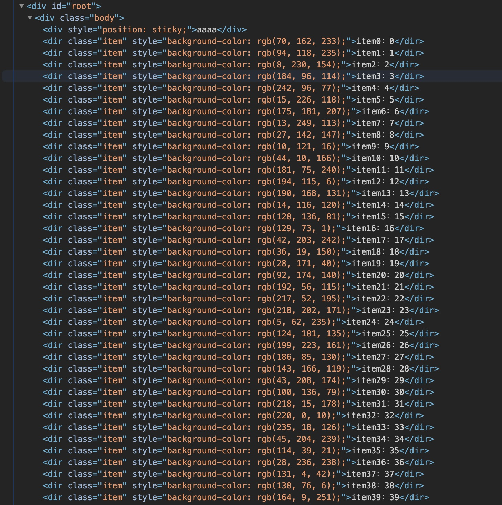
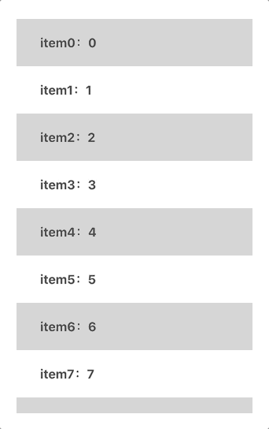

前两天项目的二期优化中有一项是`滚动下拉加载Table卡顿优化`。

说实话刚开始我对这个优化项完全没有头绪。一度认为只是接口拿到`加载的新数据拼接新数组再渲染导致的卡顿`。所以优化方向一直在往怎么`高效拼接数组，高效rerender`的方向去思考。

直到我打开`F12`才意识到**此事并不简单🤔**



> 这只是我模拟的项目中真实Dom渲染的效果，意在说明DOM太多了

可以看到，现在的真实效果就是`有多少数据，我们就要对应渲染多少DOM`。这个问题在小数据量的时候很难意识到，因为我一直都是这么写的。但是在`大数据量`面前简直就是灾难。

> It's a disaster!!!! (只是玩个dota轮盘梗😂)

那么就进入今天的正题，虚拟列表(Virtual List)。

# 什么是Virtual List

先给出一段专业的定义，来自[浅说虚拟列表的实现原理](https://github.com/dwqs/blog/issues/70)

> 虚拟列表是按需显示思路的一种实现，即虚拟列表是一种根据滚动容器元素的可视区域来渲染长列表数据中某一个部分数据的技术。

可能还是一脸懵逼？🤦‍♂️那么，我用大白话描述一下就是`我只需要显示该显示的几个DOM就好了。`

那么`该显示`的划分标准是什么？我个人的理解就是`用户能看到的数据，就是该显示的，一切用户看不到的数据，就不要把DOM渲染出来了。`


## 那到底是怎么做到的呢？


> 图片源于[浅说虚拟列表的实现原理](https://github.com/dwqs/blog/issues/70)

可以看到图中标出的


# 现在我们来手写一个虚拟列表🤯

## 先搭个项目才能开始表演

依旧是常规操作

```
$ npx create-react-app virtual-scroll
```

然后我需要把项目里不需要的代码修修改改。为了方便我就单写一个`Test.jsx`把`index.js`中引用的App换成Test即可。

## 把原始的长列表写出来

当然在用`虚拟列表`优化一个很卡顿的界面[之前]，我们得先有一个很卡顿的界面。

### 1. 首先我需要有大量的加数据，写一个函数生成一下

```js
// Test.jsx
function mockData() {
  const tempData = [];
  for (let i = 0; i < 100; i++) {
    tempData.push({ label: `item${i}`, value: i });
  }

  return tempData;
}
```

这里没有让加数据很复杂，因为我个人感觉是不必要的，我们要做的不是优化每一行内部的繁杂内容，而是在一个`想对宏观`的角度去优化一个`大的DOM或是一个界面`。

所以每行我以`一个简单的对象`为例，结构大致为
```js
{ label: 'testLabel', value: 1 }
```

### 2. 然后我们来写一个列表渲染这些数据

```js
const Test = () => {

  const [data] = useState(mockData());

  const onScroll = (e) => {
    console.log(e);
  }

  return (
    <div className={"body"} on  onScroll={(e) => onScroll(e)}>
      {data.map((item) => (
        <dir
          className="item"
          style={{ backgroundColor: `rgb(${Math.random() * 255}, ${Math.random() * 255}, ${Math.random() * 255})` }}
          key={item.value}
        >
          {`${item.label}：${item.value}`}
        </dir>
      ))}
    </div>
  );
}
export default Test;
```

现在有一个具体的界面了，稍后就在这个空架子里把虚拟列表加上。

现在界面长这个样子。


可以打开控制台看一下，现在假数据有`100`条，就要渲染100个div。


## 3. 计算要展示的元素个数

上面说到这一步也是比较关键的一步，首先我们获取`可视区域`的高度

```
展示元素个数 = Math.ceil(可视区域高度 / 行高) + Buffer
```

计算可视区域

```js
useEffect(() => {
  const ele = document.getElementById('vt');
  const vtStyle = window.getComputedStyle(ele);

  const tempRowCount =
    Math.ceil(Number(/[0-9]*(?=px)/.exec(vtStyle.height)[0]) / ROW_HEIGHT) + BUFFER;
  setRowCount(tempRowCount);
}, []);
```

能算出`需要渲染的个数`，然后我们就能算出`数据的起始/终止位置`。

```js
// 算展示元素的起始位置
const startIndex = useMemo(() => {
  return ~~(currentTop / ROW_HEIGHT);
}, [currentTop]);

// 算展示元素的终止位置
const endIndex = useMemo(() => {
  return startIndex + rowCount;
}, [startIndex, rowCount]);

// 根据起始终止位置截取要显示的数据
const showData = useMemo(() => {
  return data.slice(startIndex, endIndex);
}, [startIndex, endIndex, data]);
```

当然这里有个小插曲就是我给每个item是`随机颜色`, 但是每次重新render颜色随机会变成这个样子😂


所以我换成`奇偶差色`的背景色了。


-------------------
// 修复便边界值闪烁的问题

-------------------


## 4. 为什么滚动不起来？

我拿到了应该显示在`可视范围`的数据，为什么确是这个样子？



**其实导致这个问题的原因非常简单！！！**

因为我们`只是截取了数据`，这么多数据刚好滚动到底就`不会再触发`onScroll。

所以计算`rowCount / startIndex / endIndex`的行为也都停下来了。

这时候我们需要做的事情就是，`让滚动事件一直能触发下去`。这样计算就不会停止，也就可以达到虚拟列表的初步效果了。


> 图片源于[浅说虚拟列表的实现原理](https://github.com/dwqs/blog/issues/70)

再来看一次这张图，图中蓝色括号标出的`offset`区域，就是我们接下来要说的部分。

### 现在是什么效果？

我们截取到了根据滚动位置计算出来的`应该显示在可视区域`的一段数据。**但是我们现在让这段数据`继续滚动下去`**达到的效果是`离开了可视区域而无法继续触发滚动事件`。

### 所以我们接下来应该做的

接下来应该做的就是`一直都能触发滚动事件`，也就是`不要让这段数据离开可视区域`。

所以我们需要一个`startOffset`来一直在顶部`“顶着”`这段数据不要离开可视区域。

这个过程可以用大白话表述为：如果我们向上滚动了`一个row height`， 那么我们就需要`一个row height`的offset来把滚出可视区域的元素顶回原位。**滚动了多少个单位行高，就需要相同的高度来将列表数据顶在可视范围之内。**

```js
// Test.jsx

// 上偏移量，需要给偏移量让截取的数据始终显示在可视区域才能一直有scroll事件
const startOffset = useMemo(() => {
  return ~~(currentScroll / ROW_HEIGHT) * ROW_HEIGHT;
}, [currentScroll]);
```

上面这段代码`~~(currentScroll / ROW_HEIGHT)`代表`有几个元素滚动出了可视区域`，再乘一个行高就是我们想要的`offset`的值。

我们需要一个实际的DOM去做这件事，把这个DOM放在我们要渲染的列表上方就好。

```html
<div style={{ paddingTop: startOffset }}></div>
```

然后就达到了这个效果


> 动图太大影响博客整体的界面加载，所以动图很短

可以看到我们已经实现了无限滚动直到数据真正到底显示完毕。😄👍

## 5. 为什么滚动条这么奇怪？？😳

细心的小伙伴，你也发现不了，因为我动图太短了😂👻

滚动条有点奇怪


为什么越向下加载滚动条越来越短了？？？

可能只是后我会说`数据越来越多，滚动条自然越来越短了。滑稽.jpg`

**如果我们没有做虚拟滚动的话，是这么个道理没错，随着DOM的增加，自然数据变多，总体高度变高，滚动条就会越来越矮。**

但是我们现在已经做到`虚拟滚动`了，DOM一共就那么几个，为什么还会出现这种情况。

### 原来是我忽略了那个让整个List滚动起来的`startOffset`🤦‍♂️

虽然DOM就那么几个，`startOffset`却为了一直让数据在可视区域不断地增加着。


所以我们还需要一个东西，来让一开始的整个`Virtual List`的高度跟`正常渲染全部数据之后的高度一样`。

```js
// Test.js

// 下偏移量，需要让总高度始终等于dataSource.length * rowHeight，要不然滚动条会异常
const endOffset = useMemo(() => {
  return data.length * ROW_HEIGHT - startOffset - (endIndex - startIndex) * ROW_HEIGHT;
}, [data, startOffset, startIndex, endIndex]);
```
这个算式看起来很麻烦，其实就是下面这个公式

```
endOffset = 全部数据总高度 - startOffset - 可视区域数据高度
```

我们也同样需要一个实际的DOM来做这个工作，放在渲染的可视数据下方

```html
<div style={{ paddingBottom: endOffset }}></div>
```


**可以看到滚动条在一开始就已经是正常高度了，后面也不会再变。**

## 到现在，我们就已经完成了一个最基本的Virtual List


# 源码


# 相关参考

- [浅说虚拟列表的实现原理](https://github.com/dwqs/blog/issues/70)
- [虚拟滚动的轮子是如何造成的？](https://juejin.im/post/6844903598510309390#heading-6)
- [使用 React + Rxjs 实现一个虚拟滚动组件](https://segmentfault.com/a/1190000017839560)


