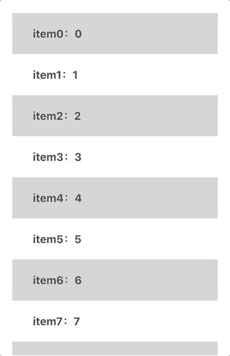

前两天项目的二期优化中有一项是`滚动下拉加载Table卡顿优化`。

说实话刚开始我对这个优化项完全没有头绪。一度认为只是接口拿到`加载的新数据拼接新数组再渲染导致的卡顿`。所以优化方向一直在往怎么`高效拼接数组，高效rerender`的方向去思考。

直到我打开`F12`才意识到**此事并不简单🤔**


> 这只是我模拟的项目中真实Dom渲染的效果，意在说明DOM太多了

可以看到，现在的真实效果就是`有多少数据，我们就要对应渲染多少DOM`。这个问题在小数据量的时候很难意识到，因为我一直都是这么写的。但是在`大数据量`面前简直就是灾难。

> It's a disaster!!!! (只是玩个dota轮盘梗😂)

那么就进入今天的正题，虚拟列表(Virtual List)。

# 什么是Virtual List

先给出一段专业的定义，来自[浅说虚拟列表的实现原理](https://github.com/dwqs/blog/issues/70)

> 虚拟列表是按需显示思路的一种实现，即虚拟列表是一种根据滚动容器元素的可视区域来渲染长列表数据中某一个部分数据的技术。

可能还是一脸懵逼？🤦‍♂️那么，我用大白话描述一下就是`我只需要显示该显示的几个DOM就好了。`

那么`该显示`的划分标准是什么？我个人的理解就是`用户能看到的数据，就是该显示的，一切用户看不到的数据，就不要把DOM渲染出来了。`


## 那到底是怎么做到的呢？


> 图片源于[浅说虚拟列表的实现原理](https://github.com/dwqs/blog/issues/70)

可以看到图中标出的`可视区域`，这就是用户能看到的数据区域

> 注：通常我们为了让滚动看起来更真实平滑，可视区域的大小，或者说需要展示在可视区域的数据数量往往是大于真实的可视区域一点。

而虚拟列表的原理也非常简单，就是`只在可视区域内展示数据即可`，用户看不到的数据我们也不需要让浏览器渲染，这样渲染的DOM数就会大大缩小。

### 如何做到上述这一点？

我们可以根据滚动距离和可视范围的上限来`计算出该渲染数据的数据下标`，也就是`startIndex`。那么`渲染数据的截止下标就可以根据行高和startIndex`计算出来(这是固定高的虚拟列表)。

图中另一个比较显眼的是`可滚动区域`，可能这么标示不是很好理解，换种说法就是，如果我真的把数据都渲染出来，那么所需要的高度，或者说所占高度就是这里的`可滚动区域`。

可滚动区域的高度是一定的。当然就算是下拉滚动，总数据量会随着加载逐渐变多，那么把每次加载操作之后看作一个新列表的话，其实列表高度也是一定的。`可滚动区域 = 数据数量 * 每行高度`

**而关键就在怎么渲染这么有限的数据还能让`滚动事件`一直都能够触发**。

这时候就需要用到图中的`startOffset和endOffset来撑开整个容器`，这里的容器是实际渲染数据所在的DOM容器，因为实际渲染的数据个数很有限，容器高度自然就不会很高，`甚至有可能都不会形成滚动条`。所以需要这两个变量来撑开容器。

### 来个小总结

我们要做到的效果是`只渲染用户可见范围内所需要显示的数据`。

- 要做的第一步就是计算startIndex和endIndex从而得到需要渲染的数据。
- 第二部就是让滚动事件提供的`滚动距离`参与到`startIndex`和`endIndex`的计算中来通过滚动实时渲染出可视区域内的数据。
- 第三步则是需要做到`如何能一直触发滚动事件？`就需要`startIndex`和`endIndex`的帮助来撑开容器，让滚动一直都在。


# 现在我们来手写一个虚拟列表🤯

## 先搭个项目才能开始表演

依旧是常规操作

```
$ npx create-react-app virtual-scroll
```

然后我需要把项目里不需要的代码修修改改。为了方便我就单写一个`Test.jsx`把`index.js`中引用的App换成Test即可。

## 把原始的长列表写出来

当然在用`虚拟列表`优化一个很卡顿的界面[之前]，我们得先有一个很卡顿的界面。

### 1. 首先我需要有大量的加数据，写一个函数生成一下

```js
// Test.jsx
function mockData() {
  const tempData = [];
  for (let i = 0; i < 100; i++) {
    tempData.push({ label: `item${i}`, value: i });
  }

  return tempData;
}
```

这里没有让加数据很复杂，因为我个人感觉是不必要的，我们要做的不是优化每一行内部的繁杂内容，而是在一个`想对宏观`的角度去优化一个`大的DOM或是一个界面`。

所以每行我以`一个简单的对象`为例，结构大致为
```js
{ label: 'testLabel', value: 1 }
```

### 2. 然后我们来写一个列表渲染这些数据

```jsx

const Test = () => {

  const [data] = useState(mockData());

  const onScroll = (e) => {
    console.log(e);
  }

  return (
    <div className={"body"} on  onScroll={(e) => onScroll(e)}>
      {data.map((item) => (
        <div
          className="item"
          style={{ backgroundColor: `rgb(${random() * 255}, ${random() * 255}, ${random() * 255}` }}
          key={item.value}
        >
          {`${item.label}：${item.value}`}
        </div>
      ))}
    </div>
  );
}
export default Test;

```

现在有一个具体的界面了，稍后就在这个空架子里把虚拟列表加上。

现在界面长这个样子。


可以打开控制台看一下，现在假数据有`100`条，就要渲染100个div。


## 3. 计算要展示的元素个数

上面说到这一步也是比较关键的一步，首先我们获取`可视区域`的高度

```
展示元素个数 = Math.ceil(可视区域高度 / 行高) + Buffer
```

计算可视区域

```js
useEffect(() => {
  const ele = document.getElementById('vt');
  const vtStyle = window.getComputedStyle(ele);

  const tempRowCount =
    Math.ceil(Number(/[0-9]*(?=px)/.exec(vtStyle.height)[0]) / ROW_HEIGHT) + BUFFER;
  setRowCount(tempRowCount);
}, []);
```

能算出`需要渲染的个数`，然后我们就能算出`数据的起始/终止位置`。

```js
// 算展示元素的起始位置
const startIndex = useMemo(() => {
  return Math.floor(currentTop / ROW_HEIGHT);
}, [currentTop]);

// 算展示元素的终止位置
const endIndex = useMemo(() => {
  return startIndex + rowCount;
}, [startIndex, rowCount]);

// 根据起始终止位置截取要显示的数据
const showData = useMemo(() => {
  return data.slice(startIndex, endIndex);
}, [startIndex, endIndex, data]);
```

当然这里有个小插曲就是我给每个item是`随机颜色`, 但是每次重新render颜色随机会变成这个样子😂（稍后我们解决这个问题）


> 所以我暂时换成`奇偶差色`的背景色了。


## 4. 为什么滚动不起来？

我拿到了应该显示在`可视范围`的数据，为什么确是这个样子？


**其实导致这个问题的原因非常简单！！！**

因为我们`只是截取了数据`，这么多数据刚好滚动到底就`不会再触发`onScroll。

所以计算`rowCount / startIndex / endIndex`的行为也都停下来了。

这时候我们需要做的事情就是，`让滚动事件一直能触发下去`。这样计算就不会停止，也就可以达到虚拟列表的初步效果了。


> 图片源于[浅说虚拟列表的实现原理](https://github.com/dwqs/blog/issues/70)

再来看一次这张图，图中蓝色括号标出的`offset`区域，就是我们接下来要说的部分。

### 现在是什么效果？

我们截取到了根据滚动位置计算出来的`应该显示在可视区域`的一段数据。**但是我们现在让这段数据`继续滚动下去`**达到的效果是`离开了可视区域而无法继续触发滚动事件`。

### 所以我们接下来应该做的

接下来应该做的就是`一直都能触发滚动事件`，也就是`不要让这段数据离开可视区域`。

所以我们需要一个`startOffset`来一直在顶部`“顶着”`这段数据不要离开可视区域。

这个过程可以用大白话表述为：如果我们向上滚动了`一个row height`， 那么我们就需要`一个row height`的offset来把滚出可视区域的元素顶回原位。**滚动了多少个单位行高，就需要相同的高度来将列表数据顶在可视范围之内。**

```js
// Test.jsx

// 上偏移量，需要给偏移量让截取的数据始终显示在可视区域才能一直有scroll事件
const startOffset = useMemo(() => {
  return Math.floor(currentScroll / ROW_HEIGHT) * ROW_HEIGHT;
}, [currentScroll]);
```

上面这段代码`Math.floor(currentScroll / ROW_HEIGHT)`代表`有几个元素滚动出了可视区域`，再乘一个行高就是我们想要的`offset`的值。

我们需要一个实际的DOM去做这件事，把这个DOM放在我们要渲染的列表上方就好。

```jsx

<div style={{ paddingTop: startOffset }}></div>

```

然后就达到了这个效果


> 动图太大影响博客整体的界面加载，所以动图很短

可以看到我们已经实现了无限滚动直到数据真正到底显示完毕。😄👍

## 5. 为什么滚动条这么奇怪？？😳

细心的小伙伴，可能发现滚动条有点奇怪😂👻




为什么越向下加载滚动条越来越短了？？？

可能只是后我会说`数据越来越多，滚动条自然越来越短了。滑稽.jpg`

**如果我们没有做虚拟滚动的话，是这么个道理没错，随着DOM的增加，自然数据变多，总体高度变高，滚动条就会越来越矮。**

但是我们现在已经做到`虚拟滚动`了，DOM一共就那么几个，为什么还会出现这种情况。

### 原来是我忽略了那个让整个List滚动起来的`startOffset`🤦‍♂️

虽然DOM就那么几个，`startOffset`却为了一直让数据在可视区域不断地增加着。


所以我们还需要一个东西，来让一开始的整个`Virtual List`的高度跟`正常渲染全部数据之后的高度一样`。

```js
// Test.js

// 下偏移量，需要让总高度始终等于dataSource.length * rowHeight，要不然滚动条会异常
const endOffset = useMemo(() => {
  return data.length * ROW_HEIGHT - startOffset - (endIndex - startIndex) * ROW_HEIGHT;
}, [data, startOffset, startIndex, endIndex]);
```
这个算式看起来很麻烦，其实就是下面这个公式

```
endOffset = 全部数据总高度 - startOffset - 可视区域数据高度
```

我们也同样需要一个实际的DOM来做这个工作，放在渲染的可视数据下方

```jsx

<div style={{ paddingBottom: endOffset }}></div>

```


**可以看到滚动条在一开始就已经是正常高度了，后面也不会再变。**

### 到现在，我们就已经完成了一个最基本的Virtual List

---

## 把刚才遇到的问题都解决一下💪

### 先来把遇到的颜色问题修复一下😄

这个修复起来很简单，只需要稍微做下改动就好，直接上代码

```js
function mockData() {
  const tempData = [];
  for (let i = 0; i < 100; i++) {
    tempData.push({
      label: `item${i}`,
      value: i,
      color: `rgb(${Math.random() * 255}, ${Math.random() * 255}, ${Math.random() * 255})` });
  }
  return tempData;
}
```

可以看到我给生成假数据的数据中添加一个color项，这样每个颜色就是专属那条数据的了。


### 然后是数据闪烁的问题

> 很遗憾`之前`的解释是错误的，我已经删除，现在给出的是正确的解释


可以看到`startIndex`的值一直在2和3之间来回改变，导致界面是疯狂闪动的。`startIndex`的闪烁正恰恰说明了依赖`滚动距离`计算出来的`startIndex`闪烁的真正原因是`滚动距离`在闪烁。


**可以从最底部的源码中step2中触发这个错误**

如果这时把滚动距离打印出来看一看的话，一定是在`两个值之间反复横跳`，而这两个值永远都是`相差60`。

其实造成闪烁的过程是这个样子

- 假设滚动距离此时为`65`，那么我们计算`startIndex`就是`65 ➗ row_height = 1.x 约等于 1`
- 所以现在数据从`1`开始，那么index为`0`的元素就被`截掉`了。
- 这时`滚动距离就从65 -> 5`，因为`少`了一个元素的高度
- 而这时`滚动距离`的改变会`触发startIndex再次计算`，这时`5 ➗ row_height = 0.x 约等于 0`
- 那么这个时候又会从第`0`个元素开始截取数据，`这时候第0个元素又回来了`
- 这时`滚动距离就从5 -> 65`，因为`多`了一个元素的高度
- `startIndex`就是`65 ➗ row_height = 1.x 约等于 1`
- ...无限反复横跳。

这个闪烁的问题在我们`添加startOffset`之后就没有了。

---

### 引入绝对定位来去掉offset(去掉padding)

这时候就要引出第二种虚拟列表的样式写法也就是`绝对定位`。

绝对定位的写法就可以解决这个问题。

因为`利用padding撑开的容器`上下的`offset`都是依赖滚动距离来进行计算的`且因为是用padding去左右实际显示的内容`，所以在某个边界值就会导致：
  - 根据`当前滚动距离`计算出一个`starOffset`来作为`paddingTop`的值
  - 赋予`新的pdding`后，会对当前第一个item造成一定的位移
  - 新的位移会触发新的滚动事件
  - 这样就形成了无限循环，从而出现抖动

--- 

改成绝对定位的元素，`每个item已经脱离normal flow`不会受到padding的影响，当然，现在改成绝对定位的排列也就`不需要上下的offset`去撑开整个容器了。

```jsx

// top = index * row_height
<div className="bodyContainer" style={{ height: data.length * ROW_HEIGHT }}>
  {showData.map((item) => (
    <div
      className="item"
      style={{ backgroundColor: item.color, top: item.value * ROW_HEIGHT }}
      key={`${item.value}`}
    >
      {`${item.label}：${item.value}`}
    </div>
  ))}
</div>

```

可以看到改成绝对定位后，`我们只需要给每个item一个自己的top值`即可。然后我们将容器的高度设置成`数据个数 * 行高`。这么一来就没有上下offset的干扰了。

理解绝对定位布局的虚拟列表比之前带有offset好理解。

- 先想如果`用绝对定位布局写一个普通的列表`，其实就是在计算`每个item距离top的距离`。而这个距离正好就是`top = index * row_height`。整个容器需要的高度是`height = data.length * row_height`。
- 在`列表虚拟化之后`，这个计算的方法`唯一`受影响的就是计算top值中的`index`。
- 这个`index`因为数据是截取过的所以`不能是当前数组中item的index`。而应该是`item在原数组中的index`。
- 这一点是很容易就可以做到的。

---

## 大功告成⛽️


# 源码

[点这里](https://github.com/hanqizheng/hanqizheng.github.io/tree/master/assets/sourceCode/VirtualList)


# 相关参考

- [浅说虚拟列表的实现原理](https://github.com/dwqs/blog/issues/70)
- [虚拟滚动的轮子是如何造成的？](https://juejin.im/post/6844903598510309390#heading-6)
- [使用 React + Rxjs 实现一个虚拟滚动组件](https://segmentfault.com/a/1190000017839560)


