其实这一期我早就想写了，应该是年初的时候，那会在家隔离，但一直没写出来。

感谢春雷的提示🎉🎉


# 契机

其实就是偶然需要重新登陆一下QQ，结果看到了这么一个Button。

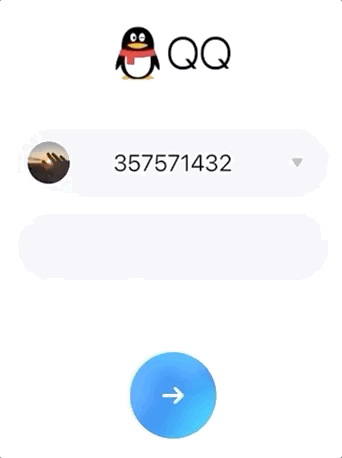

> GIF的画质实在不行，可以自行QQ退出登录看一下😂

### 可以看到这个Button的效果是`背景是渐变色且是动态的`。


---

当时最开始的想法是用`CSS`的`linear-gradient`或者`radial-gradient`来实现。**但是没做出来**。

但是这次发现了两个`秘密武器`以后，离目标缩短了十万八千里。

别的不说，引出两个秘密武器！！😄

# CSS filter: hue-rotate()

引用

> ## How does Hue Rotation Work?
> 
> HSL (which stands for Hue Saturation Lightness) is a hue-based representation of the RGB color space of computer graphics. The HSL model is widely considered to be more intuitive than the RGB model. This is because, the HSL model allows you to select a base hue, and then adjust its saturation and lightness as desired.

## 大致翻译一下 😅

HSL代表的是

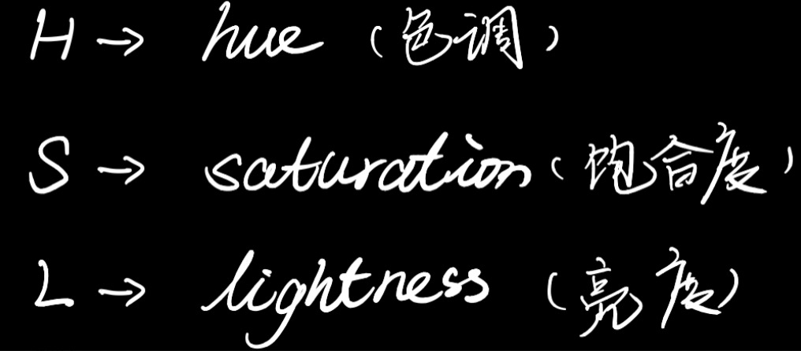

HSL（代表色相饱和度亮度）是计算机图形的RGB颜色空间的基于色相的表示。人们普遍认为HSL模型比RGB模型更直观。这是因为，HSL模型允许您选择基本色相，然后根据需要调整其饱和度和亮度。


`hue-rotate()`的参数最普遍的是接受一个`角度值`作为参数。

我们来看一张图就明白了。


H代表`hue`也就是`色调`。以这个色环的最上部为`0 deg`，也就是`red`为起点，顺时针旋转对应的角度，其对应DOM的颜色也会改变。如果现在`div是一个红色的div`,旋转`120 deg`这个div就会变成`green 绿色`。


# 我们来先写一个小Demo来看一下

依旧是常规操作

```
$ npx create-react-app virtual-scroll
```

然后我需要把项目里不需要的代码修修改改。为了方便我就单写一个`Test.jsx`把`index.js`中引用的App换成Test即可。

我们需要一个可以拖动的`drag bar`来调节数值。

```jsx

<div id="dragBar" className="dragBar" onMouseMove={handleMouseMove}>
  <div
    id="dragSpot"
    className="dragSpot"
    style={{ top: hueDegree }}
    onMouseDown={handleMouseEvent}
    onMouseUp={handleMouseEvent}
    onMouseLeave={() => setIsMouseDown(false)}
  />
  <span className="dragText">{`${hueDegree}deg`}</span>
</div>

```

我需要一个值`来记录色环的旋转角度`

```js
const [hueDegree, setHueDegree] = useState(0);
```

然后需要一种`drag操作`来改变`hueDegree`。这里需要`3个`事件一起结合实现。

```js
// 用来记录是否按下鼠标的状态标志
const [isMouseDown, setIsMouseDown] = useState(false);

const handleMouseEvent = (e) => {
  setIsMouseDown(e.type === 'mousedown')
}
```

然后我们需要通过`onMouseMove()`来获取鼠标`y轴`的`偏移距离`。但是这个距离是相对于`浏览器窗口的`，所以我们需要记录`上一次的偏移距离`来和本次偏移量`求出差值`。

```js
const handleMouseMove = useCallback((e) => {
  if (isMouseDown) {
    // 求出差值
    const degOffset = e.clientY - preHueDegree;
    // 更新上次偏移量便于下次计算
    setPreHueDegree(e.clientY);
    // 更新hueDegree
    setHueDegree(hueDegree + degOffset);
  }
}, [preHueDegree, hueDegree, isMouseDown]);
```

效果是这个样子

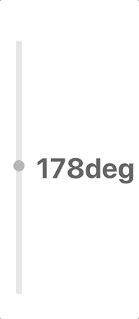

但是可以看到他会超出（0 - 360）的范围，所以我们需要加一个限制。

```js
const handleMouseMove = useCallback((e) => {
  if (isMouseDown) {
    const degOffset = e.clientY - preHueDegree;
    setPreHueDegree(e.clientY);
    if (hueDegree + degOffset >= 360) {
      setHueDegree(360);
      setIsMouseDown(false);
      return;
    }
    if (hueDegree + degOffset <= 0) {
      setHueDegree(0);
      setIsMouseDown(false);
      return;
    }
    setHueDegree(hueDegree + degOffset);
  }
}, [preHueDegree, hueDegree, isMouseDown]);
```

这样就好啦。

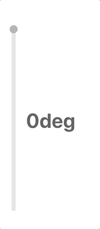

然后我们需要一个用来展示`hue-rotate`效果的图形，我就随便画个圆。

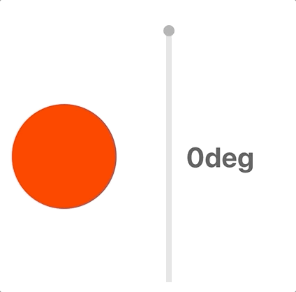

默认给这个圆的背景色`red`，让其从`0deg`开始，可以看到随着`hue-rotate()`的参数不断的改变，颜色也随之改变。


# 生活处处都用到的`高斯模糊`, filter: blur()

高斯模糊在生活中很多地方用到，比如`ios系统`就有太多太多高斯模糊了

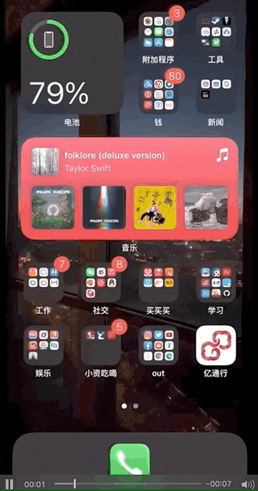

> GIF的画质又一次吐血

我们要做到高斯模糊只需要使用`filter: blur()`即可。接受的参数是一个模糊的值。

```css
.test {
  filter: blur(20px);
}
```

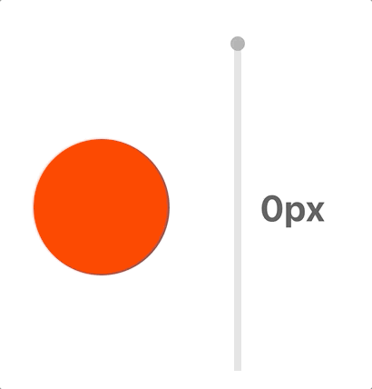


# 进入今天主题

介绍了两个秘密武器之后，我们接下来用CSS写一下这个按钮。

## 其实原理非常非常简单

我们先来看一张图


- 图中的`白圈就是按钮本身`。
- 3个`蓝色的圆`是要操作的关键。
- 分别赋予`3个蓝色的圆不同的animation`。
- 而每个`animation`内部其实改变的就是`颜色`以及`让圆圈模糊后和背景融合`
- 给button本身一个`背景色`

## 1. 先来一个Button本身

```jsx

// button本身
<div
  className="buttonBody"
  style={{ height, width }}
>
  ...
</div>

```
`height`和`width`作为`ColorfulButton`组建的`props`传入可以让用户自定义button的宽高，默认值`都是150px`。

```css
.buttonBody {
  position: relative;
  border-radius: 50%;
  background-color: #35c6ff;
}
```

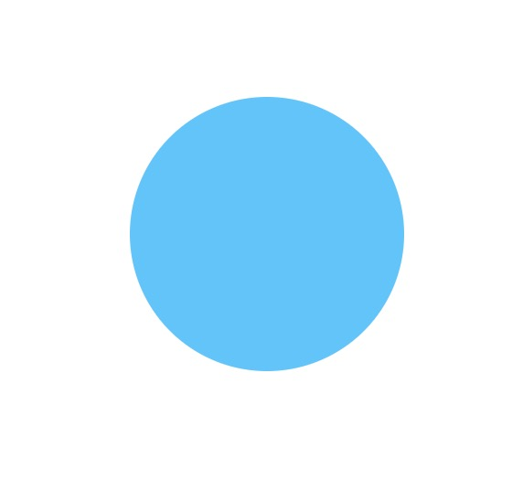

## 2. 然后我们先来一个spot(也就是上图中蓝色的圆)

我们先让他的`色调`随时间改变。因为我默认按照`red`为起始色，所以我需要按照`上方的色环图`，可以看出蓝色主要聚集在`200 - 240 deg`这个范围。

```jsx

<div
  className="spot"
  style={{
    top: '50%',
    left: '50%',
    transform: 'translate(-50%, -50%)',
    backgroundColor: spotColor,
  }}
></div>

```

```css
.spot {
  position: absolute;
  border-radius: 50%;
  height: 75px;
  width: 75px;
  animation: spotTest 3s ease infinite;
}

@keyframes spotTest {
  0% {
    filter: hue-rotate(200deg);
  }
  50% {
    filter: hue-rotate(240deg);
  }
  100% {
    filter: hue-rotate(200deg);
  }
}

```

达成的效果就是这个样子

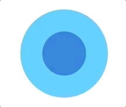

## 3. 接下来请出高斯模糊

```css

@keyframes spotTest {
  0% {
    filter: blur(20px) hue-rotate(200deg);
  }
  50% {
    filter: blur(20px) hue-rotate(240deg);
  }
  100% {
    filter: blur(20px) hue-rotate(200deg);
  }
}

```

然后可以发现模糊程度很大，基本快和Button的背景色融合了。

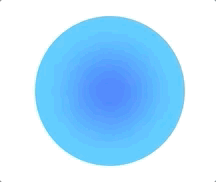

## 4. 再多来几个这样的Spot

```css
.spot1 {
  position: absolute;
  border-radius: 40%;
  animation: spotColorChange1 10s ease infinite;
}

.spot2 {
  position: absolute;
  border-radius: 70%;
  animation: spotColorChange2 10s ease infinite;
}
```

其实就是单独写了动画，为了后续`animation`要更改`宽高`，所以顺便把`height`和widht移到动画中。

```css

@keyframes spotColorChange1 {
  0% {
    height: 105px;
    width: 90px;
    filter: blur(20px) hue-rotate(210deg);
  }
  60% {
    height: 130px;
    width: 130px;
    filter: blur(20px) hue-rotate(230deg);
  }
  100% {
    height: 105px;
    width: 90px;
    filter: blur(20px) hue-rotate(210deg);
  }
}

@keyframes spotColorChange3 {
  0% {
    height: 140px;
    width: 125px;
    filter: blur(20px) hue-rotate(220deg);
  }
  30% {
    height: 90px;
    width: 90px;
    filter: blur(20px) hue-rotate(210deg);
  }
  70% {
    height: 70px;
    width: 100px;
    filter: blur(20px) hue-rotate(230deg);
  }
  100% {
    height: 140px;
    width: 125px;
    filter: blur(20px) hue-rotate(220deg);
  }
}

```

为了让大家看的更清楚，我把先前Button写好的`background-color`换成了`border`


可以看到经过`hue-rotate / blur / 宽高改变`后的`3个Spot`和Button现在的关系是这个样子

当然我们Button`以外的`地方无需显示，所以我们添加一句

```css
overflow: hidden;
```

再把`background-color`改回来看一下效果。

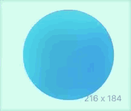

### 啊哈😁，已经有初步的样子了。

## step5. 让背景色动起来

其实就是在动画中加上位移

类似这样～

```css
@keyframes spotColorChange {
  0% {
    height: 125px;
    width: 120px;
    filter: blur(20px) hue-rotate(210deg);
    transform: translate(-70%, -70%) rotate(0deg);
  }
  40% {
    height: 135px;
    width: 130px;
    filter: blur(30px) hue-rotate(230deg);
    transform: translate(60%, -50%) rotate(-100deg);
  }
  100% {
    height: 125px;
    width: 120px;
    filter: blur(20px) hue-rotate(210deg);
    transform: translate(-70%, -70%) rotate(0deg);
  }
}
```

### Spot有些不太显眼，我们也改进一下～👻

为了让效果更平滑舒适，让Button的背景色也在不同的蓝色之间动起来，从而突出动态的背景Spot。

```css

.buttonBody {
  position: relative;
  border-radius: 50%;
  overflow: hidden;
  animation: bg ease 5s infinite;
}

@keyframes bg {
  0% {
    background-color: #56cfff;
  }
  30% {
    background-color: #16dcff;
  }
  70% {
    background-color: #2cb2ff;
  }
  100% {
    background-color: #56cfff;
  }
}

```

最后再加上` -> `

```js
import arrow from './arrow.svg'
```

```jsx

 

```

# 最终效果

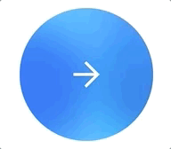

这样我们就大功告成了！！🎉🎉

# 相关源码

[点这里！！](https://github.com/hanqizheng/hanqizheng.github.io/tree/master/assets/sourceCode/colorfulButton)

# 相关参考

- [CSS Background 之神奇渐变色](https://juejin.im/entry/6844903463273365517)
- [CSS hue-rotate() Function](https://www.quackit.com/css/functions/css_hue-rotate_function.cfm)
- [hue-rotate()](https://developer.mozilla.org/en-US/docs/Web/CSS/filter-function/hue-rotate)
- [blur()](https://developer.mozilla.org/en-US/docs/Web/CSS/filter-function/blur)