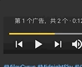

最近的我，有点才思枯竭的感觉🤯。其实就是拖延。

众所周知喜欢搞一些花里胡哨的东西。继上次的`gradient` & `hue-rotate`之后

今天我们引来了一个新的神级属性(自封)`clip`，ta～da～! 

## 先来个简单的


可以看到这是一段文本，但是这个文本`花里胡哨的`。

对，它是彩色的。

## background-clip

秘密就在这个属性`background-clip`。

```html
<span className="textContainer"> text </span>
```

```css
.textContainer {
  display: flex;
  justify-content: center;
  align-items: center;
  height: 300px;
  width: 300px;
  font-size: 60px;
  font-weight: bold;

  /* 看下面，秘密在这 */
  background: linear-gradient(to right, rgb(42, 177, 1), blue);
  background-clip: text;
  color: transparent;
}
```

可以看到首先我给了 background 一个渐变。

**这里我最初犯了一个错误：**

`gradient`系列属性是`background-image`的一种属性！

`gradient`系列属性是`background-image`的一种属性！

`gradient`系列属性是`background-image`的一种属性！

### 这个属性是干什么的？

那么我更喜欢从`clip`这个词说起。

- `clip`: **n.** 夹子 ｜ **vt.** 把...夹住, 把夹子别上, 修剪。

那么`background-clip`要怎么理解呢？

其实这里的`clip`显然是一个`名词`。当然在这里直接翻译成`背景-夹子`多少有点 der。可以意译为`背景-裁剪区域`。

它有 3 个属性。

- background-clip: border-box;

  ```css
  .textContainer {
    border: 10px solid #000000;
    background: linear-gradient(to right, rgb(42, 177, 1), blue);
    background-clip: border-box;
  }
  ```

  

  wait a minute, what the hell am I doing...这样根本这样根本看不出来效果。

  改一下

  ```css
  .textContainer {
    border: 10px dashed #000000;
  }
  ```

  可以看到`border-box`是说允许背景色的范围到`border`

  

- background-clip: padding-box;

  

  可以看到在设定了`padding-box`之后背景色的范围就仅限`除了`border 以外的范围。

- background-clip: content-box;

  为了能和上一个`padding-box`有所区别，我先加一些 padding 让 content 和 padding 不一样大。

  ```css
  .textContainer {
    padding: 50px;
    border: 10px dashed #000000;
    background: linear-gradient(to right, rgb(42, 177, 1), blue);
    background-clip: content-box;
  }
  ```

  

- background-clip: text;

  那么这个就是仅限文字所显示的区域。

  

  但是这个情况就如同上述 border 的情况，text 本身把 background`挡住了`。

  加一句

  ```css
  .textContainer {
    color: transparent;
  }
  ```

  

## 当然还有另一种实现彩色字体的方法 - mask

CSS中的mask属性允许用户屏蔽或剪裁特定点的图像来实现，部分或完全隐藏某个元素的可见性。


通过添加一个伪元素来完成mask的`半透明遮罩`效果，这样我们就能得到其中一个颜色的渐变效果，然后再把文本原有的颜色与之相结合，就能达到渐变特效。如上图大概就是`3层效果`叠加在一起。

```html
<span text="text" className="textContainer">
  text
</span>
```

```css
.textContainer {
  /* text原有的颜色 */
  color: green;
}

.textContainer::before {
  content: attr(text);
  position: absolute;
  z-index: 10;
  /* 伪元素的颜色(渐变色的另一色) */
  color: blue; 
  /* 渐变透明的遮罩 */
  mask: linear-gradient(to left, green, transparent);
}
```

效果如下


# clip-path

接下来引出第二个神奇的属性`clip-path`。这个属性个人认为比`background-clip`还要神奇一些。

> The clip-path CSS property creates a clipping region that sets what part of an element should be shown. Parts that are inside the region are shown, while those outside are hidden.


上面这段话是`mdn`对`clip-path`的定义。这次我们可以把`clip-path`翻译成`裁剪路径`了（233333)。`规定了element要显示的范围，范围之外全部 be hidden`

这个属性特别强大，我们最终可以做到将一块的内容裁剪成自己想要的任意形状。

涉及到两个概念：`clipping path(裁剪路径)` & `clipping region(裁剪区域)`。

其实这两个概念非常好理解，
- `clipping path(裁剪路径)`就相当于你在纸上画好的需要裁剪的线，剪刀沿着这条线进行裁剪。
- `clipping region(裁剪区域)`就相当与你最终剪下来的那片纸，是裁剪路径围成的图形。

`clipping path`可以接受很多参数，分为几个大类型(常用的)：

- `basic-shape`接受一些基本图形，比如circle(), polygon()等。
- `geometry-box`这个属性我没弄明白有什么含义。

## 用clip-path制作一个YouTube的暂停/播放按钮动画

先看一下YouTube的暂停/播放按钮效果是什么样的。



### 首先我需要用`clip-path`画两个矩形。

```html
<div className="buttonBody">
  <div className="rectangle1"></div>
  <div className="rectangle2"></div>
</div>
```

```css
.rectangle1 {
  height: 200px;
  width: 75px;
  background: #ffffff;
  clip-path: polygon(0% 0%, 0% 100%, 70% 100%, 70% 0%);
  transition: clip-path 0.5s ease;
}

.rectangle2 {
  height: 200px;
  width: 75px;
  background: #ffffff;
  clip-path: polygon(0% 0%, 0% 100%, 70% 100%, 70% 0%);
  transition: clip-path 0.5s ease;
}
```

可以看到我在绘制`矩形`使用的是`polygon()`。他接受具体的点值或者百分比。大概原理如下图。


然后可以看到两个矩形在绘制时给的坐标点时`一摸一样的`，因为这个百分比`是相对当前容器的宽度`。


### 然后我要让两个矩形分别动起来。

因为是demo我就`不用click`来触发事件而是用`hover`。

先是左边的这个矩形的效果。

可以看出来变化的过程是左边变短。

```css
.rectangle1:hover {
  clip-path: polygon(0% 0%, 0% 100%, 100% 75%, 100% 25%);
}
```

给出的4个点


 

但是看起来总觉得怪怪的，对比一下原版


可以看到这个矩形变形的同时是变宽了的。

```css
.rectangle1:hover {
  clip-path: polygon(0% 0%, 0% 100%, 100% 75%, 100% 25%);
}
```


然后是第二个矩形的变形，他这次是变成一个三角形。


```css
.rectangle2:hover {
  clip-path: polygon(0% 25%, 0% 75%, 100% 50%);
}
```

**但是如果直接给出polygon()里的参数变为3个点，会导致过渡动画失效的问题。**


所以这里给出一个骚操作, 可以把最后两个点`坐标定义成一样的`。

```css
.rectangle2 {
  clip-path: polygon(0% 25%, 0% 75%, 100% 50%, 100% 50%);
}
```

这样就可以了，当然，右边的变形也是带有宽度改变的。


最后把他俩合在一起。

然后把hover事件放在父元素。

```html
<div className="buttonBody">
  <div className="rectangle1"></div>
  <div className="rectangle2"></div>
</div>
```

```css
.rectangle1 {
  height: 200px;
  width: 75px;
  background: #ffffff;
  clip-path: polygon(0% 0%, 0% 100%, 70% 100%, 70% 0%);
  transition: clip-path 0.5s ease;
}

.buttonBody:hover .rectangle1 {
  clip-path: polygon(0% 0%, 0% 100%, 100% 75%, 100% 25%);
}


.rectangle2 {
  height: 200px;
  width: 75px;
  background: #ffffff;
  clip-path: polygon(30% 0%, 30% 100%, 100% 100%, 100% 0%);
  transition: clip-path 0.5s ease;
}

.buttonBody:hover .rectangle2 {
  clip-path: polygon(0% 25%, 0% 75%, 100% 50%, 100% 50%);
}
```

最终的效果


# 参考

- [简单说 通过 CSS 实现 文字渐变色 的两种方式](https://segmentfault.com/a/1190000011882933)
- [CSS —— gradient 渐变专题](https://juejin.cn/post/6844903593800105992)
- [CSS 奇思妙想边框动画](https://juejin.cn/post/6918921604160290830#heading-6)
- [mdn - linear-gradient](<https://developer.mozilla.org/zh-CN/docs/Web/CSS/linear-gradient()>)
- [mdn - background-image](https://developer.mozilla.org/zh-CN/docs/Web/CSS/background-image)
