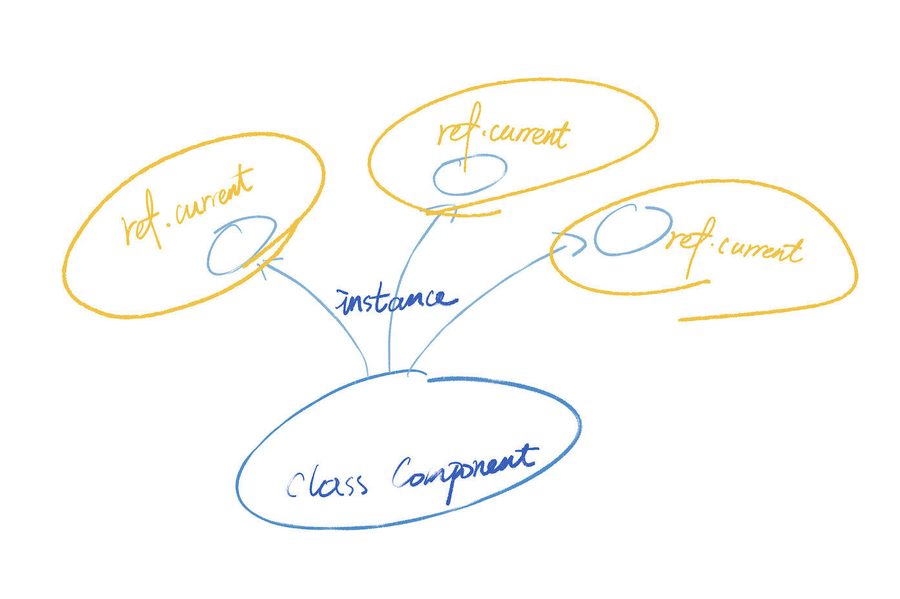

写 React 难免会看到这个词。 

每次用都有一种迷迷糊糊的感觉，好像并不是真的了解`ref`的用法。 

今天，就来让自己进一步了解一下`ref`。

# ref到底是什么

先来翻出[React官方文档](https://reactjs.org/docs/refs-and-the-dom.html)的定义，逐字看一下(本人糙翻，有错请指出)。

Refs provide a way to access DOM nodes or React elements created in the render method.

`Refs`提供了一种在`render`方法内获取`DOM`或`React元素`的方式。

In the typical React dataflow, props are the only way that parent components interact with their children. To modify a child, you re-render it with new props. 

在React的`数据流`中，`props`是父组件与子组件的唯一通信方式。我们可以通过更新(传入新的)`props`来让子组件`重新渲染`。


However, there are a few cases where you need to imperatively modify a child outside of the typical dataflow. The child to be modified could be an instance of a React component, or it could be a DOM element. For both of these cases, React provides an escape hatch.

然而，在一些情况下，我们需要以传统`数据流之外`的方式修改子组件。而被修改的`child`可以是` React 组件的一个实例`，或者一个`DOM 元素`。

对于这些情况，React提供了`Refs`。


So... 是什么情况下，需要以传统数据流以外的方式去修改Ref呢？什么情况呢？

# 为什么需要ref

带着疑惑，发现官方文档紧接着就给出了一些可以使用`Refs`的good case：

- 操控 光标focus、文本选中或者音频播放
- 触发一些受控的(命令式)Animation
- 继承一些第三方的DOM库


## 所以到底什么是传统数据流意外的方式呢？

以下是我个人的理解：

在官方文档中，所说的`传统数据流`，其实就是**单向数据流**。

props像水流一样，流入子组件，然后数据在子组件内起作用。

而ref的引入就像是“打破”了这样的数据流形式。可能说“打破”不太准确，只是不遵循这样的数据流形式。

通过暴露子组件的ref给父级组件，这样就好像实现了子组件的数据或行为“逆流而上”的效果。

还有一种情形就是需要操作一些DOM的特有行为或属性，比如focus / blur之类的，也需要用到ref。


下面给出Refs的基本用法

> [例子来自React官方文档](https://zh-hans.reactjs.org/docs/refs-and-the-dom.html#adding-a-ref-to-a-class-component)

## DOM节点使用Refs

```jsx
// 给DOM节点添加ref

class CustomTextInput extends React.Component {
  constructor(props) {
    super(props);
    // 创建一个 ref 来存储 textInput 的 DOM 元素
    this.textInput = React.createRef();
    this.focusTextInput = this.focusTextInput.bind(this);
  }

  focusTextInput() {
    // 直接使用原生 API 使 text 输入框获得焦点
    // 注意：我们通过 "current" 来访问 DOM 节点
    this.textInput.current.focus();
  }

  render() {
    // 告诉 React 我们想把 <input> ref 关联到
    // 构造器里创建的 `textInput` 上
    return (
      <div>
        <input
          type="text"
          ref={this.textInput} />
        <input
          type="button"
          value="Focus the text input"
          onClick={this.focusTextInput}
        />
      </div>
    );
  }
}

```

> [例子来自React官方文档](https://zh-hans.reactjs.org/docs/refs-and-the-dom.html#refs-and-function-components)

## React.Element使用Refs

```jsx
// 给React.Element添加ref

class AutoFocusTextInput extends React.Component {
  constructor(props) {
    super(props);
    this.textInput = React.createRef();
  }

  componentDidMount() {
    this.textInput.current.focusTextInput();
  }

  render() {
    return (
      <CustomTextInput ref={this.textInput} />
    );
  }
}

```

这个例子跟上面的DOM节点是有不同的，DOM节点是html中的已有标签。而现在这个例子中的`CustomTextInput`是我们用React自己写的组件。

## Refs 和 函数组件

函数组件有一个特点，其实 **并不是** 函数组件的特点，而是函数和class本身的特点。

**类是需要实例化对象的**。所以我们对类组件使用refs实际上是将类组件实例化的对象作为refs的current值。



但是函数没有实例化的对象，所以refs也就没有值。

> By default, you may not use the ref attribute on function components because they don’t have instances:


```jsx

function MyFunctionComponent() {
  return <input />;
}

class Parent extends React.Component {
  constructor(props) {
    super(props);
    this.textInput = React.createRef();
  }
  render() {
    // This will *not* work!
    return (
      <MyFunctionComponent ref={this.textInput} />
    );
  }
}

```

## forwardRef

但是并非无计可施。

我们可以通过ref转发来完成。什么是ref转发呢？来看看官方的🌰

```jsx

const FancyButton = React.forwardRef((props, ref) => (
  <button ref={ref} className="FancyButton">
    {props.children}
  </button>
));

// You can now get a ref directly to the DOM button:
const ref = React.createRef();
<FancyButton ref={ref}>Click me!</FancyButton>;

```

> [例子来自React官方文档](https://zh-hans.reactjs.org/docs/refs-and-the-dom.html#refs-and-function-components)


这个例子很明显，我们可以把`forwardRef`理解成一个`高阶组件`。

函数组件本身没有实例所以我们即使给它传入了ref也是不起作用的。

而`forwardRef`就是让函数组件能够接收ref属性。

怎么做到的呢？

其实就是返回的组件第二个参数接受ref这个参数了。


## useImperativeHandle

`useImperativeHandle`与`forwardRef`搭配使用。

`forwardRef`让函数组件具备了接收ref的能力。

`useImperativeHandle`能够控制对外暴露的ref所具备的内容。这样我们就不需要将所有内容都全盘拖出了。


```jsx

function FancyInput(props, ref) {
  const inputRef = useRef();
  useImperativeHandle(ref, () => ({
    focus: () => {
      inputRef.current.focus();
    }
  }));
  return <input ref={inputRef} />;
}
FancyInput = forwardRef(FancyInput);

```

例子里的`useImperativeHandle`就控制到只暴露了`focus`这个方法。


## useRef

刚刚才指出函数组件不能使用ref，需要通过forwardRef来组合才可以。

那useRef是什么样的存在呢？

首先需要分清楚一个概念，函数组件不能使用ref是指不接受ref这个属性值。因为没有实例。

但是内部依然是可以使用ref的！


```jsx

function TextInputWithFocusButton() {
  const inputEl = useRef(null);
  const onButtonClick = () => {
    // `current` points to the mounted text input element
    inputEl.current.focus();
  };
  return (
    <>
      <input ref={inputEl} type="text" />
      <button onClick={onButtonClick}>Focus the input</button>
    </>
  );
}

```

之前说过ref.current 其实就是组件实例。

但是useRef所创建的ref比还要再灵活，因为useRef所创建的current可以赋值成任意可变值。

其实就是一个普通的js对象

```
{ current: ... }
```

> [例子来自React官方文档](https://reactjs.org/docs/hooks-reference.html#useimperativehandle)

useRef生成的对象唯一的不同点就是useRef**每次渲染所返回的都是同一个js对象**。


# 不要过度使用Refs

很多场景是可以通过props解决的

而refs给人一种立竿见影，什么都能拿到的感觉，就很容易出现滥用


# 参考

- [Refs and the DOM](https://reactjs.org/docs/refs-and-the-dom.html)
- [Forwarding Refs](https://reactjs.org/docs/forwarding-refs.html)
- [从零开始的react入门教程（十一），react ref 详解，三种写法与 ref 转发（传递）](https://www.cnblogs.com/echolun/p/15046086.html)
- [A Complete Guide to useEffect](https://overreacted.io/a-complete-guide-to-useeffect/#swimming-against-the-tide)